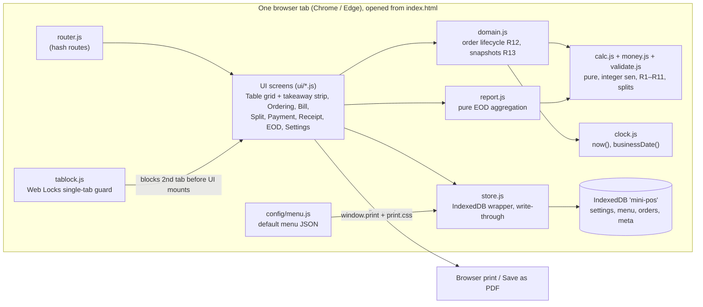

# Architecture v1.3: Restaurant Mini POS, Malaysia (Phase 1)

| Item | Value |
|---|---|
| Document | Architecture v1.3 (v1 at `da3a194`, v1.1 at `85255fa`, v1.2 at `039d05a`) |
| Status | **READY_FOR_REVIEW** (reviewers: IE for buildability, QA for testability) |
| Input | PRD v0.4 at `1573027` (74 Must ACs; v0.2 APPROVED by SA and QA, v0.3 editorial, v0.4 adds R14, AC-83, AC-84, AC-85), traced to URS blob `951a849` |
| Author | SA |
| Date | 2026-10-01 |
| Design rule | Simplest design that satisfies every Must AC. Plain HTML/CSS/JS, no framework, no runtime dependency, no build step for the app. |

Normative precedence: where this document and the PRD disagree, the PRD wins and this document is a defect. PRD R13 governs AC-54 (fixed in PRD v0.3). PRD R14 governs which business date the EOD counts a bill or a void on.

---

## 1. Components and data flow



**Flow of one sale:** the waiter taps an item → `domain.addItem()` returns a new order object with the snapshotted name and price → `store.saveOrder()` writes it through to IndexedDB immediately → the screen re-renders and calls `calc.computeBill()` for the running total. Opening the Bill screen calls `domain.openBill()` (status Bill Requested, lines committed). Payment calls `store.payOrder()`, which in **one IndexedDB transaction** re-reads the order, refuses if it is already paid, allocates the bill number, freezes totals and settings into `order.bill`, and saves.

**Startup:** `tablock.acquire()` first. If another tab holds the lock, show the blocking notice and mount nothing else (AC-82). Otherwise `store.init()` opens the DB, seeds defaults from `config/menu.js` and built-in default settings on first run, loads settings, menu and all unpaid/unclosed orders into memory, and the router renders.

**Why each component exists (minimum check):**

| Component | Needed because |
|---|---|
| calc / money / validate | NF-05 requires a separate, unit-tested calculation module. Validation (R11) is pure and shares money parsing. |
| domain | R12/R13 lifecycle rules are the most defect-prone logic after calc. Keeping them pure makes them unit-testable without a browser. |
| report | EOD sums (AC-50/51, SM-08) are pure arithmetic over bills and are unit-tested like calc. |
| store | UR-42 persistence, AC-81 atomic payment, A-27 capacity. |
| clock | One place for "now" and the MYT business date (A-28); lets QA override time (AC-07, AC-49, AC-53). |
| tablock | AC-82. |
| router | Seven screens in one page with working Back. About 40 lines. |

No other components. No framework, no state library, no service worker (NF-02 is Should and out of this version).

## 2. Data model

All money is integer **sen** (`…Sen`). All rates are integer **basis points** (`…Bp`, 6% = 600, 10.25% = 1025), which is exact because R11 allows at most 2 decimals. Timestamps are ISO strings from `clock.now()`. `businessDate` is `YYYY-MM-DD` in device local time (MYT). Per R14, an order's opening date never decides which EOD day anything counts on: a bill counts on its payment date, a voided line on its void date.

### IndexedDB `mini-pos`, schema version 1

| Store | Key | Indexes | Content |
|---|---|---|---|
| `settings` | `'current'` | – | one Settings document |
| `menu` | `'current'` | – | one Menu document |
| `orders` | `id` | `state`; `billDate` (keyPath `bill.businessDate`); `voidDates` (keyPath `voidDates`, multiEntry) | every order, open, paid or closed without bill; paid orders carry `bill` |
| `meta` | name | – | `schemaVersion`, counters |

IndexedDB leaves a record out of an index when the keyPath doesn't resolve, so unpaid orders (`bill` is `null`) are never in `billDate`, and orders with no voids have an empty `voidDates` and are never in that index. No opening-date index exists, on purpose (R14).

### Entities

**Settings**
- `restaurant`: `name`, `ssmNo`, `address`, `phone`, `sstRegNo`
- `tables`: `[{ id, name }]` (id is stable; name is editable, unique ignoring case; 1–50 entries)
- `serviceCharge`: `{ dineIn: { enabled, rateBp }, takeaway: { enabled, rateBp } }` (defaults: dine-in on 1000, takeaway off 1000)
- `sst`: `{ enabled, rateBp, includesServiceCharge }` (defaults: on, 600, true)
- `rounding`: `{ enabled }` (default true)
- `receiptFooter`: string (default "Thank you! Terima kasih! 谢谢!")

**Menu**
- `categories`: `[{ id, name, sort }]`
- `items`: `[{ id, categoryId, name, priceSen, image }]` (`image` is an optional relative path such as `images/nasi-lemak.jpg`; empty means placeholder icon)

**Order**
- `id` (random), `type` (`'dine_in' | 'takeaway'`), `tableId` (dine-in) or `takeawayNo` (`'TA-001'`, allocated at creation)
- `state`: `'ordering' | 'bill_requested' | 'paid' | 'closed_no_bill'`; `closed`: boolean (dine-in: set by the one-tap reset to Empty; takeaway: set at payment; both: set by Close without bill, AC-84)
- `openedDate` (business date at opening, informational only, never indexed), `openedAt`, `closedAt`
- `voidDates`: sorted distinct `void.businessDate` values of this order's lines, maintained by `domain.voidLine` (feeds the multiEntry index)
- `lines`: `[Line]`
- `billDiscount`: `null | { kind: 'pct', bp } | { kind: 'rm', sen }`
- `split`: `null | { mode: 'equal', n } | { mode: 'item', count, assign: { lineId: subIndex } }`
- `bill`: `null` until paid, then the frozen **Bill**

**Line**
- `id`, `itemId`, `name` and `unitPriceSen` (snapshotted at add, R13), `qty`, `note`, `committed` (R12), `void`: `null | { reason, at, businessDate }` (`businessDate` is `clock.businessDate(at)`, the date the void counts on per R14)

**Bill** (frozen inside `order.bill` at payment)
- `billNo` (`B-YYYYMMDD-NNNN`), `paidAt`, `businessDate` (of payment)
- `settingsUsed`: the SC, SST and rounding settings in force at payment, plus `restaurant` header fields
- `totals`: `{ subtotalSen, discountSen, serviceChargeSen, sstSen, preRoundingSen, roundingSen, grandTotalSen }`
- `split`: `null | { mode, subBills: [{ label: '/1', amountSen, lineIds? }], remainderSen }`
- `payment`: `{ method, cashReceivedSen?, changeSen? }`
- `void`: `null` (populated only if UR-30 ships)

**meta counters**
- `billSeq`: `{ date, next }`, `takeawaySeq`: `{ date, next }`. When `date` differs from today's business date, `next` restarts at 1.

**Empty orders are never kept (AC-83):** an order with zero lines is deleted when the Ordering screen is left (any route change away from `#/order/:id`), and a reload counts as leaving (PM ruling on AC-83): the startup load deletes **every** zero-line order, and if the current route pointed at one it is replaced with `#/tables`, where that table shows Empty. A voided line still counts as a line, so an all-voided order is not empty and uses AC-84 instead. A takeaway number used by a discarded order is not reissued (the counter never goes back).

**Derived, never stored:** table status (from the table's unclosed order: none → Empty, else its `state`, with `paid` → Paid until `closed`), totals of unpaid orders (always recomputed from lines and current settings, R13), EOD figures.

### Capacity check (A-27)

A paid order is about 1–1.5 KB as JSON. 5,000 bills is about 7.5 MB, which exceeds the roughly 5 MB localStorage limit but is far inside IndexedDB's quota. Only unpaid orders are held in memory; EOD reads one day's paid bills through the `billDate` index and that day's voids through the `voidDates` index.

## 3. Interfaces the MVP needs

There is no network API. These are the module interfaces IE builds and QA tests against. Everything in `calc`, `money`, `validate`, `domain` and `report` is a pure function on plain objects.

### `money.js`
- `parseMoney(text) → { ok, sen } | { ok: false, error }` (string parsing, no float; rejects more than 2 decimals, negatives, non-numeric)
- `formatRM(sen) → 'RM 12.34'`; `formatSigned(sen) → '+0.02' | '−0.02' | '0.00'`
- `parseRate(text) → { ok, bp } | error` (0–100, at most 2 decimals)

### `calc.js`
- `halfUpDiv(numerator, denominator)` integer half-up division (non-negative inputs)
- `roundTo5Sen(sen) → sen` (R8)
- `computeBill({ lines, billDiscount, orderType, settings }) → { subtotalSen, discountSen, baseSen, serviceChargeSen, sstSen, preRoundingSen, roundingSen, grandTotalSen }` (R2–R9 exactly, in that order, SC rounded before the SST base per R5)
- `splitEqual(grandTotalSen, n) → { amounts[], remainderSen }`
- `splitByItem(grandTotalSen, bases[]) → { amounts[], remainderSen }` (floor of `grand × base_i / Σbase`, remainder to index 0; all zero when Σbase = 0)
- `cashChange(dueSen, receivedSen) → { ok, changeSen } | { ok: false, reason }`

### `validate.js` (R11)
- `validateTables(tables)`, `validateMenuItem(item)`, `validateRates(settings)`, `validateSplitN(n)`, `validateDiscount(d, subtotalSen)` → `{ ok } | { ok: false, field, message }`

### `domain.js` (R12, R13)
- `newDineIn(tableId, now)`, `newTakeaway(takeawayNo, now)`
- `addItem(order, menuItem)`, `incQty(order, lineId)`, `decQty(order, lineId)` (refused on committed lines), `setNote(order, lineId, text)`, `voidLine(order, lineId, reason, now)` (reason required; stamps `void.businessDate` and updates `voidDates`)
- `openBill(order)` (Bill Requested, commits lines; refused if no non-voided line, AC-33)
- `isEmpty(order)` (zero lines, voided or not; AC-83)
- `canCloseWithoutBill(order)`, `closeWithoutBill(order, now)` (allowed only when the order has ≥1 line and every line is voided, in Ordering or Bill Requested; sets `state: 'closed_no_bill'`, `closed: true`, `closedAt`; no bill, no bill number; AC-84)
- `setBillDiscount(order, d)`, `setSplit(order, split)`, `assignLine(order, lineId, subIndex)`, `canPay(order) → { ok } | reason` (AC-33, AC-36)
- `closeTable(order)` (Paid → closed)
- Adding an item to a Bill Requested order returns it to Ordering and **clears any split assignment** (new lines are unassigned anyway).

### `report.js`
- `summariseDay(date, paidOrders, voidOrders) → { billCount, grossSen, discountSen, serviceChargeSen, sstSen, roundingSen, netSen, byMethod{}, byType{}, voidedItems[], voidedBills[] }` where `paidOrders` are the orders whose `bill.businessDate` is `date` (all bill totals and breakdowns come only from these) and `voidOrders` are the orders with any void dated `date`, whatever their state (only lines with `void.businessDate === date` are listed). The two sets can overlap; bills and voids are counted independently (R14, AC-85).

### `store.js` (async, IndexedDB)
- `init() → { settings, menu, openOrders }`
- `saveSettings(s)`, `saveMenu(m)`, `saveOrder(o)`
- `nextTakeawayNo(date)` (atomic counter)
- `deleteOrder(id)` (only for zero-line orders, AC-83; refuses anything else)
- `payOrder(orderId, payment) → Bill` (**one `readwrite` transaction over `['orders','meta','settings']`**: re-read the order, refuse if not payable or already paid, read settings, allocate `billNo`, compute and freeze totals synchronously, save. No `await` on anything outside that transaction's requests, so it can't auto-commit early)
- `billsByDate(date)` (via `billDate`), `ordersWithVoidsOn(date)` (via `voidDates`), `resetAll()` (clear every store, reseed defaults)

### `clock.js`, `tablock.js`
- `clock.now()`, `clock.businessDate(date)`, `clock.setOverride(isoOrNull)` (test hook, see §5)
- `tablock.acquire() → Promise<boolean>`

### Routes
`#/tables`, `#/order/:id`, `#/bill/:id`, `#/split/:id`, `#/pay/:id`, `#/receipt/:id`, `#/eod?date=YYYY-MM-DD`, `#/settings`

### File layout
```
index.html
css/   tokens.css  base.css  components.css  screens.css  print.css
js/    money.js calc.js validate.js domain.js report.js
       store.js clock.js tablock.js router.js app.js
       ui/ tables.js order.js bill.js split.js pay.js receipt.js eod.js settings.js
config/ menu.js            (default menu: fixed wrapper around strict JSON, see AD-04)
fonts/  NotoSansSC-subset-400.woff2  NotoSansSC-subset-700.woff2  OFL.txt
images/ (optional menu images)
tests/  unit/*.test.js     (node:test, zero dependencies)
        e2e/*.spec.js      (Playwright, dev-only)
        fixtures/seed-200-items-500-bills.json
tools/  subset-font.sh  make-fixture.js   (dev-only)
README.md  package.json (devDependencies only)
```

All app scripts are classic `<script>` tags in dependency order. Each pure module ends with a guard that exports to `module.exports` under Node and to `window.POS.<name>` in the browser, and resolves its own dependencies with `typeof module !== 'undefined' ? require('./x.js') : window.POS.x`, so the same file runs in the app and in `node --test`. Toolchain: Node 20 LTS.

`tools/subset-font.sh` needs `pyftsubset` (Python fonttools). It is dev-only and the generated `.woff2` files are committed, so neither the app nor NF-07 depends on it; the README documents it.

## 4. Key decisions

| ID | Decision (chosen) | Rejected alternative | Reason |
|---|---|---|---|
| AD-01 | Vanilla JS, classic scripts, no build step | React/Vue, or ES modules | NF-01 and NF-07. Chrome blocks ES modules over `file://`, and staff will open `index.html` directly. |
| AD-02 | Primary run mode is opening `index.html` from disk; a static server also works | Server-only | NF-06. Windows has no built-in static server, so requiring one means installing something. |
| AD-03 | IndexedDB through a small hand-written wrapper (no library) | localStorage | A-27 capacity (about 7.5 MB at 5,000 bills, above localStorage's limit), and IndexedDB transactions make payment atomic (AC-81). Fallback to localStorage only if the T-01 spike fails. |
| AD-04 | Default menu shipped as `config/menu.js` in a fixed format: line 1 is exactly `window.POS_DEFAULT_MENU =`, then a strict-JSON payload, then a final line `;`. Settings also exports the menu as a plain `.json` file and imports it back | `fetch('config/menu.json')` | Browsers block `fetch` of local files over `file://`. The payload stays strict JSON (QA strips the wrapper and runs `JSON.parse`). Accepted by QA; logged by PM as D-04 for July. |
| AD-05 | Integer sen and basis points, integer half-up division | Floats with `toFixed`; a decimal library | UR-22 with zero dependencies. The largest product (sen × bp) stays far below 2^53. |
| AD-06 | Bill number allocated at payment, inside the payment transaction | Allocate when the Bill screen opens | Abandoned or reopened orders never burn numbers, so numbering stays gap-free and never reused (AC-49, AC-81). |
| AD-07 | Write-through on every mutation | Save on interval or `beforeunload` | MTS-10 / AC-55: a refresh at any moment loses nothing. |
| AD-08 | Single-tab guard with the Web Locks API (`navigator.locks`, `ifAvailable`) | BroadcastChannel heartbeat, or a lock flag in storage | The lock is released by the browser when the tab closes or crashes, so there is never a stale lock to clear. |
| AD-09 | Bundled Noto Sans SC subset (Latin plus about 3,500 common Chinese characters, weights 400 and 700), generated by a dev-only script | Full Noto Sans SC (over 10 MB per weight); Google Fonts CDN | NF-01, A-26. System CJK fallback in the CSS font stack covers rare characters (AC-13). |
| AD-10 | Unit tests on Node's built-in `node:test` | Jest, Mocha | Zero dependencies (NF-07). |
| AD-11 | Playwright as the **only** devDependency, for e2e and the AC-63 timing run | Manual-only browser testing | AC-55, AC-61, AC-62, AC-63, AC-81 and AC-82 need a real browser, run in both Chrome and Edge, with repeatable evidence. Dev-only, never loaded by the app. |
| AD-12 | Unpaid totals always recomputed from lines and current settings; frozen into `bill` at payment | Store running totals on the order | R13 by construction; no stale totals to keep in sync. |
| AD-13 | One receipt layout: a 72 mm content column (80 mm paper's printable width) via `@media print`, centred on the page | Separate 80 mm and A4 templates | AC-46 with one stylesheet; on A4 it prints as a neat centred column. |
| AD-15 | EOD reads by payment date and void date through two indexes (`billDate`, multiEntry `voidDates`) | One index on the opening date | R14 / AC-85: an order opened 23:50 and paid 00:10 counts on the new date, a line voided 23:55 on the old one. IndexedDB skips unpaid orders in `billDate` automatically. |
| AD-16 | Zero-line orders are deleted on leaving Ordering; all-voided orders end in `closed_no_bill` | Keep empty orders; add a generic Cancel order | AC-83 and AC-84 exactly, with no new scope. Keeping `closed_no_bill` records (not deleting them) preserves their voids for EOD. |
| AD-14 | Render with template strings and an `escapeHtml()` helper on every user-entered string | Unescaped `innerHTML`; a templating library | Item names, notes and reasons can't break the layout or inject markup; no dependency. |

## 5. Security, failure modes, observability

### Security (what applies)
- Fully local: no network calls, no login, no secrets (NF-01). AC-61 is verified by observing network traffic in the e2e run; the app references no external URL.
- All user-entered text is HTML-escaped before rendering (AD-14). No `eval`, no inline event-handler strings built from data.
- Data lives in the browser profile. On `file://`, Chrome and Edge treat every local file as one origin, so any other local HTML file opened in that browser could read the POS data. This is accepted for a single counter device and noted in the README (RS-07).
- "Reset all data" needs a confirmation step (AC-56).

### Failure modes

| Failure | Behaviour |
|---|---|
| A write to IndexedDB fails (quota, disk) | A blocking error banner appears; the in-memory change is rolled back; payment is never shown as complete unless its transaction committed. |
| Double tap on Confirm payment (AC-81) | The button is disabled on first tap, **and** `payOrder` re-reads inside the transaction and refuses an already-paid order. Either guard alone is enough; both are cheap. |
| Second tab opened (AC-82) | It fails to get the lock, shows "already open in another tab", and mounts no screen. |
| Refresh or crash mid-entry (AC-55) | Nothing is lost because every change was already written (AD-07). |
| Midnight passes during service (A-28, R14) | Takeaway numbers are allocated by date at creation; bill numbers and `bill.businessDate` by date at payment; each void by date at void time. An order opened 23:50 and paid 00:10 counts on the new date; a line it voided at 23:55 counts on the old date (AC-85). |
| Table opened by mistake, or every uncommitted line removed (AC-83) | Leaving Ordering deletes the zero-line order; the table shows Empty; no bill or bill number is used. |
| Every line voided (AC-84) | Payment stays blocked (AC-33). The Ordering and Bill screens show **Close without bill**; one tap sets `closed_no_bill` and frees the table. The voids stay on that order and appear in their void date's EOD. |
| Settings changed while orders are open (R13) | Unpaid totals recompute on next render; paid bills keep `settingsUsed`. |
| Removing a table with an open order (AC-05) | `validateTables` refuses it per R10. |
| Menu edits (R10, R13) | Deleting a category that still has items is blocked with a message; deleting an item is allowed, and open orders keep their snapshotted lines. |
| Browser storage cleared or evicted (RK-02) | The app calls `navigator.storage.persist()` on first run to reduce eviction risk; the README warns about clearing browser data. Backup (UR-43) is Should. |
| Unknown schema version on load | Show a blocking error rather than guess. v1 is the only version. |

### Observability (what applies)
- No telemetry (NF-01). Uncaught errors (`window.onerror`, `unhandledrejection`) show a visible error banner with the message, so staff can report it.
- The app version string is shown at the bottom of Settings for support.
- Test hooks, for QA only, active only when the page is opened as `index.html?test=1`:
  - `clock.setOverride()` exposed as `window.POS.test.setNow(iso)`
  - `window.POS.test.loadFixture(json)` and `window.POS.test.reset()`
  - `window.POS.test.failNextWrite()`: the next IndexedDB write transaction is aborted, so QA can check the blocking banner, the in-memory rollback, and that payment is never shown as complete.
  - `window.POS.test.payConcurrently(orderId, payment) → Promise<[result, result]>`: calls `store.payOrder` twice in the same tick, bypassing the button, to test the transaction guard on its own (AC-81). `window.POS.test.payCallCount()` returns how many times the UI called `payOrder`, to test the button guard on its own with a double click.
  - Without `?test=1`, `window.POS.test` is `undefined` and none of these exist.
- Timing instrumentation for AC-63 (always on, no telemetry, nothing leaves the page): the router calls `performance.mark('route:start:<name>')` on route change and `performance.mark('route:rendered:<name>')` after the screen has rendered, followed by `performance.measure('route:<name>', …)`. Tap-to-paint is measured by QA with the Event Timing API (`PerformanceObserver` type `event`, whose duration runs to the next paint) under CDP 4× CPU throttling.
- Every interactive control and every totals figure carries a stable `data-testid`. Convention: `screen-element[-id]`, e.g. `order-item-card-<itemId>`, `bill-grand-total`, `pay-confirm`. Required in addition: `split-sub-amount-<n>` for each sub-bill amount, `split-remainder-marker` on /1, `blocked-msg-<rule>` for every R10 blocked-action message, `tablock-notice` for the second-tab notice, `order-close-no-bill` for Close without bill, and `error-banner` for the write-failure banner.

## 6. Tasks

| ID | Task | Depends on | Done when | ACs covered |
|---|---|---|---|---|
| T-01 | **Spike:** on `file://` in latest Chrome and Edge, confirm IndexedDB persists across browser restart, `navigator.locks` works, local `@font-face` woff2 loads, and classic scripts load. Record results in `docs/spikes/T-01.md`. | – | Each of the four is confirmed pass or fail with browser versions. If IndexedDB or Web Locks fail, SA revises AD-03/AD-08 before T-04 starts. | 55, 59, 65, 82 (risk retirement) |
| T-02 | Skeleton: file layout, `index.html`, `router.js`, `app.js` shell, CSS files, `package.json` (dev-only Playwright), `npm test` running `node --test`, README run steps (open `index.html`; static server optional). | – (runs alongside T-01) | App opens to an empty Table grid by double-clicking `index.html`; `npm test` runs; no external URL anywhere in the app. | 61, 65, 66a, 66b |
| T-03 | `money.js`, `calc.js`, `validate.js` with unit tests: W1–W5, the A-16 example, MTS-01 to MTS-07, AC-21, the 8-row rounding table, AC-30/31, AC-32/32a, equal split N = 2–20, split-by-item, cash change, every R11 rule. `calc.js` exports `computeBill`, `splitEqual` and `splitByItem` with exactly the §3 signatures under both Node and the browser. The independent SM-03 oracle is written by QA from the PRD alone in `tests/qa/oracle.test.js` (≥1,000 generated cases); IE does not write it. | T-02 | All unit tests pass, including QA's oracle with zero mismatches; SM-03 and SM-04 evidence printed by `npm test`. | 20, 21, 22, 24, 25, 27, 29, 30, 31, 32, 32a, 34, 35, 38, 42, 64; validation for 04, 11, 23, 28, 43 |
| T-04 | `store.js`, `clock.js`, `tablock.js`: schema v1, first-run seed from `config/menu.js` and default settings, write-through saves, atomic `payOrder`, daily counters for TA and bill numbers, `billDate` and `voidDates` indexes, `billsByDate`, `ordersWithVoidsOn`, `deleteOrder`, startup sweep of zero-line orders, `resetAll`, `storage.persist()`, test hooks (`?test=1`: `setNow`, `loadFixture`, `reset`, `failNextWrite`, `payConcurrently`, `payCallCount`), route `performance.mark`s. | T-01, T-02 | Fresh load seeds 20 tables T1–T20 and the default menu; data survives refresh and restart; `payConcurrently` creates exactly one bill; `failNextWrite` shows `error-banner` and leaves the order unpaid; second tab blocked; numbering restarts on a new business date under `setNow`; an order paid after midnight is returned by `billsByDate` for the new date only; `window.POS.test` is undefined without `?test=1`; reset reseeds defaults. | 03, 07, 09, 49, 55, 56, 63 (hooks), 81, 82, 83, 85 |
| T-05 | `domain.js` with unit tests for R12 and R13: add, ± qty, notes, void with reason, open bill and commit, return to Ordering, discount, split setup and line assignment, `canPay`, close table, `isEmpty`, `closeWithoutBill`, void date stamping and `voidDates`. | T-03 | Unit tests cover every R12 transition and every refusal (committed −, missing void reason, empty or all-voided order, unassigned line, empty sub-bill, Close without bill on an order with any non-voided line or with no lines); a void at 23:55 is stamped with that date. | 06, 12, 14, 15, 17, 18, 19, 33, 36, 37, 41, 44, 45, 83, 84, 85 |
| T-06 | Theme and shared components: design tokens (one primary token, one accent), font subset generated by `tools/subset-font.sh` and committed, cards with radius and shadow, buttons ≥ 44×44 px, status badge (colour plus text label), totals typography. | T-01, T-02 | Changing only the primary token recolours every primary element; fonts load with no network request; a greyscale screenshot still shows readable status labels. | 01, 02, 13, 57, 58, 59, 60 |
| T-07 | Table grid screen and takeaway strip: status per table, New Takeaway, open takeaway list, open or reopen an order, one-tap reset Paid → Empty. | T-04, T-05, T-06 | 20 tables render with correct derived status; TA-001/TA-002 created; paid takeaway leaves the strip; Paid table resets to Empty and its bill remains; a table opened and left with no lines shows Empty; a closed-without-bill table shows Empty and its takeaway leaves the strip. | 01, 02, 03, 06, 07, 07a, 44, 45, 83, 84 |
| T-08 | Ordering screen: category tabs, item cards with image or placeholder, tap to add, ± on uncommitted lines, note, void dialog with preset and free-text reasons, struck-through voided lines, running total always visible at 1280×800, discard of a zero-line order on leaving, **Close without bill** shown only when every line is voided. | T-07 | ACs pass manually and in e2e at 1280×800 and 1366×768 with no horizontal scroll. | 08, 10 (reflects menu edits), 13, 14, 15, 16, 17, 18, 19, 60, 83, 84 |
| T-09 | Bill, discount, split and payment screens: full totals block (SST line hidden when off), bill-level discount entry, equal split (N 2–20) and split by item with remainder marked on /1, payment method picker (6 methods), cash received and change, blocked actions per R10, Confirm disabled on first tap, **Close without bill** on an all-voided order, the extra `data-testid`s in §5. | T-08 | Every listed AC passes in e2e, including MTS-05 to MTS-09 through the UI. | 20, 22, 23, 24, 25, 26, 27, 28, 29, 32, 32a, 33, 34, 35, 36, 37, 38, 39, 40, 41, 42, 43, 81, 84 |
| T-10 | Receipt screen and `print.css`: header from `settingsUsed` (SST reg. no. only when SST on), body lines, totals, split breakdown, payment and change, notes, footer; 72 mm column. | T-09 | Print preview and Save as PDF on 80 mm and A4 show no clipped text; Chinese names render (MTS-12); MTS-11 shows no SST line or number. | 13, 17, 26, 39, 46, 47, 48, 49 |
| T-11 | `report.js` with unit tests, and EOD screen with date picker: totals, breakdown by method and by type, voided items, Voided bills section showing "None". Reads `billsByDate` and `ordersWithVoidsOn` only. | T-09 | Unit tests reconcile a 20-bill fixture day to the sen (SM-08); breakdowns sum to net sales and bill count; an empty date shows zeros; AC-85: an order opened 23:50 and paid 00:10 counts on the new date, its line voided at 23:55 on the old date; voids on unpaid and closed-without-bill orders appear on their void date. | 19, 50, 51, 52, 53, 84, 85 |
| T-12 | Settings screen: restaurant details, tables (count 1–50, rename, remove blocked when in use), menu CRUD and JSON import/export, SC per order type, SST rate, on/off and base, rounding, footer, Reset all data with confirmation. | T-04, T-06 | Every field saves and persists; invalid input is blocked per R10/R11; unpaid orders recompute after a rate change and paid bills don't; exporting the menu to `.json` and importing it back gives a deep-equal menu; the `config/menu.js` payload passes `JSON.parse` once the wrapper is stripped. | 04, 05, 09, 10, 11, 23, 26, 28, 54, 56 |
| T-13 | Test support for QA: `tools/make-fixture.js` generating 200 items and 500 bills **all on one business date** (worst case for EOD), the committed fixture, a `data-testid` audit against §5, and Playwright projects for Chrome and Edge (`channel: 'msedge'`). Scripts and exact commands are written by IE; QA executes them (D-08). | T-07 to T-12 | QA can seed the fixture, override the clock and drive every Must screen headlessly in both browsers; AC-55 uses a persistent browser context (`launchPersistentContext`) closed and relaunched; AC-46 uses `emulateMedia({ media: 'print' })` and `page.pdf` at 80 mm and A4, with the PDFs committed; AC-61 uses a request listener that fails the run on any non-`file://` URL; AC-63 reads Event Timing entries and the route measures under CDP 4× CPU throttling. | 55, 61, 62, 63, 81, 82 (test support) |
| T-14 | Release assets: the 7 screenshots committed under `docs/screenshots/`, final README (run, print setup, backup warning, single-tab note). | T-07 to T-12 | Screenshots of all 7 screens are present and current; README steps work on a fresh copy. | 57, 65 |

Parallelism: T-02 and then T-03 run while QA executes the T-01 spike. T-04 and T-06 start only once T-01 is recorded as passing (or SA has revised AD-03, AD-08 or AD-09). T-11 and T-12 can run in parallel after their dependencies.

## 7. AC coverage (every Must AC → at least one task)

| AC | Tasks | | AC | Tasks | | AC | Tasks |
|---|---|---|---|---|---|---|---|
| 01 | T-06, T-07 | | 24 | T-03, T-09 | | 46 | T-10 |
| 02 | T-06, T-07 | | 25 | T-03, T-09 | | 47 | T-10 |
| 03 | T-04, T-07 | | 26 | T-09, T-10, T-12 | | 48 | T-10 |
| 04 | T-03, T-12 | | 27 | T-03, T-09 | | 49 | T-04, T-10 |
| 05 | T-12 | | 28 | T-03, T-09, T-12 | | 50 | T-11 |
| 06 | T-05, T-07 | | 29 | T-03, T-09 | | 51 | T-11 |
| 07 | T-04, T-07 | | 30 | T-03 | | 52 | T-11 |
| 07a | T-07 | | 31 | T-03 | | 53 | T-11 |
| 08 | T-08 | | 32 | T-03, T-09 | | 54 | T-12 |
| 09 | T-04, T-12 | | 32a | T-03, T-09 | | 55 | T-01, T-04, T-13 |
| 10 | T-08, T-12 | | 33 | T-05, T-09 | | 56 | T-04, T-12 |
| 11 | T-03, T-12 | | 34 | T-03, T-09 | | 57 | T-06, T-14 |
| 12 | T-05 | | 35 | T-03, T-09 | | 58 | T-06 |
| 13 | T-06, T-08, T-10 | | 36 | T-05, T-09 | | 59 | T-01, T-06 |
| 14 | T-05, T-08 | | 37 | T-05, T-09 | | 60 | T-06, T-08 |
| 15 | T-05, T-08 | | 38 | T-03, T-09 | | 61 | T-02, T-13 |
| 16 | T-08 | | 39 | T-09, T-10 | | 62 | T-13 |
| 17 | T-05, T-08, T-10 | | 40 | T-09 | | 63 | T-04, T-13 |
| 18 | T-05, T-08 | | 41 | T-05, T-09 | | 64 | T-03 |
| 19 | T-05, T-08, T-11 | | 42 | T-03, T-09 | | 65 | T-01, T-02, T-14 |
| 20 | T-03, T-09 | | 43 | T-03, T-09 | | 66a | T-02 |
| 21 | T-03 | | 44 | T-05, T-07 | | 66b | T-02 |
| 22 | T-03, T-09 | | 45 | T-05, T-07 | | 81 | T-04, T-09 |
| 23 | T-03, T-09, T-12 | | | | | 82 | T-01, T-04 |
| | | | | | | | 83 | T-04, T-05, T-07, T-08 |
| | | | | | | | 84 | T-05, T-07, T-08, T-09, T-11 |
| | | | | | | | 85 | T-04, T-05, T-11 |

All 74 Must ACs (AC-01 to AC-66b plus AC-07a, AC-32a, AC-81 to AC-85) map to at least one task. MTS-01 to MTS-12 are covered through their ACs (PRD §3.14). Should ACs (AC-67 to AC-80) have no tasks in v1.

## 8. Risks

| ID | Risk | Likelihood / Impact | Mitigation |
|---|---|---|---|
| RS-01 | IndexedDB, Web Locks or local fonts behave differently on `file://` in Chrome or Edge. | Medium / High | T-01 spike runs first. Fallbacks: localStorage with a capacity warning (AD-03), a storage-flag lock (AD-08). SA revises the design before T-04 if any fail. |
| RS-02 | July rejects AD-04 (`config/menu.js` wrapping strict JSON) as not meeting UR-07's "JSON config file". | Low / Medium | QA accepted it with testable conditions; D-04 goes to July. Alternative is `menu.json` plus a required static server, which conflicts with AD-02. |
| RS-03 | Opening the app via `file://` and via a static server gives two separate data stores, so switching methods makes data appear lost. | Medium / Medium | README pins one method (open `index.html`) and explains this. |
| RS-04 | Browser storage is evicted or cleared. | Low / High | `storage.persist()`, README warning; UR-43 backup is Should (RK-02). |
| RS-05 | Thermal printer drivers add margins or scale, clipping the 72 mm column. | Medium / Medium | T-10 tests on 80 mm and A4; README covers print settings (margins none, scale 100%). |
| RS-06 | The font subset misses a character the owner types later. | Medium / Low | System CJK fallback in the font stack (A-26, AC-13). |
| RS-07 | On `file://`, other local HTML files in the same browser profile can read POS data. | Low / Low | Single counter device; documented in README. |
| RS-08 | Edge on Linux behaves differently from Edge on Windows (A-30). | Low / Low | Both are Chromium; the Windows-only differences (font rendering, print drivers) are covered by RS-05 and the README. QA runs Chrome and Linux Edge per D-08. |
| RS-09 | A future Close without bill or discard path wrongly deletes or hides voids. | Low / Medium | `deleteOrder` refuses any order with lines; T-11 tests voids on closed-without-bill orders. |

## 9. Change log

| Version | Commit | Changes |
|---|---|---|
| v1 | `da3a194` | First design. |
| v1.1 | `85255fa` | AD-04 tightened to a fixed wrapper around strict JSON (QA condition); T-12 done-criteria add the menu JSON round trip and the `JSON.parse` check; RS-02 updated. |
| v1.2 | `039d05a` | Against PRD v0.4 `1573027`. IE 1 / R14: `billDate` and multiEntry `voidDates` indexes replace the opening-date index (AD-15, AC-85). IE 2 / AC-83, AC-84: zero-line orders discarded on leaving Ordering, Close without bill sets `closed_no_bill` (AD-16). IE 3–7 recorded (payOrder scope, module guard and Node 20, pyftsubset, menu deletes, `summariseDay` inputs). QA 1–6: QA owns the SM-03 oracle; `failNextWrite`, `payConcurrently` and `payCallCount`; AC-63 marks and one-date fixture; extra `data-testid`s; T-13 done-criteria. RS-08 updated for A-30 and D-08; RS-09 added. |
| v1.3 | this commit | AC-83: a reload counts as leaving Ordering (PM ruling), so the startup sweep deletes every zero-line order and redirects to `#/tables`. §6: T-02 and T-03 no longer wait for T-01 (IE proposal; neither touches IndexedDB, Web Locks or fonts). T-04 and T-06 still wait for T-01. |
